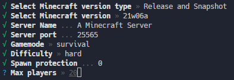

# Minecraft Server Generator
Generator for Minecraft Vanilla Server.



## Requirements
- Node.js (>= v16)
- Java

## Usage
### Install
```bash
npm i -g minecraft-server-generator
```

### Generate
```bash
generate-minecraft-server
```

### Boot
```bash
# Windows (cmd)
boot
# Windows (pwsh)
./boot
# Other (bash)
./boot.sh
```

### With screen
- bash only
```bash
# boot
./boot-screen.sh
# attach
./attach-screen.sh
# shutdown
./shutdown-screen.sh
```
